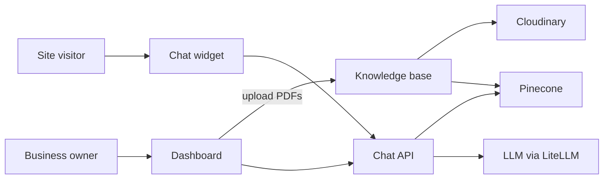

# Askdesk

**A chatbot for your website. Your customers get answers.**

Askdesk is a small product for businesses that keep answering the same questions over email: hours, pricing, insurance, house rules, how to get started. You add a chat widget to your site, train it with your own files, and visitors get those answers on the page instead of waiting on your team.

It is not a generic ChatGPT tab, not a six-week custom build, and not a full support suite. It is a chatbot on *their* site, for *their* customers.

## Who it is for

The same pattern shows up in a lot of small businesses:

| Audience | What their customers ask |
| --- | --- |
| Clinics and professional services | Hours, insurance, services |
| Courses and coaching | Fees, schedule, eligibility |
| Hotels, gyms, spas | Rates, amenities, house rules |
| Small SaaS | Setup, pricing, troubleshooting |

If people already email you those questions, they can ask the bot on your site instead.

## How it works

1. **Add the chatbot to your site.** One script tag injects an isolated chat widget (an iframe, so the host site’s CSS and JavaScript cannot break it).
2. **Train it with your files.** Upload PDFs — policies, FAQs, rate sheets, onboarding docs. They are stored, chunked, and indexed per account.
3. **Your customers get answers.** The bot retrieves the relevant excerpts and answers with citations (file name and page) instead of guessing.



## What this repo is

A Next.js app that is both the product site and the product:

- **Marketing homepage** — the pitch, a scripted clinic-site preview, and signup.
- **Dashboard** — sign in, upload documents, watch indexing status, and chat against your own knowledge base.
- **Embeddable widget** — `public/widget.js` loads `/widget` in an iframe on any host page.
- **RAG pipeline** — PDF text extraction, embeddings, per-user vector namespaces, and streaming answers.

### Product surfaces

| Surface | Route | Who uses it |
| --- | --- | --- |
| Landing | `/` | Anyone |
| Sign up / log in | `/signup`, `/login` | Business owners |
| Knowledge base | `/dashboard/knowledge-base` | Owners uploading PDFs |
| Internal chat | `/dashboard/chat` | Owners testing answers |
| Widget UI | `/widget` | Loaded inside the iframe on a customer site |

## How a question gets answered

When someone asks a question, the app does not dump the whole PDF into the model. It looks up the closest chunks in that owner’s index, then answers from those excerpts.

```
PDF upload
  → signed upload to Cloudinary
  → document row in Postgres (pending → processing → ready)
  → page-level text extraction
  → chunks (~1000 characters, 200 overlap)
  → embeddings (text-embedding-3-small)
  → Pinecone namespace `user:{userId}`

Chat
  → retrieve top matching chunks
  → stream a grounded answer (gpt-4.1-nano via LiteLLM)
  → cite file name and page when an excerpt is used
```

Each owner’s files stay isolated: Postgres rows are scoped by `userId`, Cloudinary paths live under that user’s folder, and Pinecone retrieval only searches that user’s namespace.

## Embedding the widget

On a host site (see `public/test-site.html` for a local stand-in):

```html
<script
  async
  src="http://localhost:3000/widget.js"
  data-agent-id="your-agent-id"
></script>
```

The loader reads its own origin, requires `data-agent-id`, and mounts a fixed iframe pointing at `/widget`. The iframe choice is documented in [`architecture/ADR-001-iframe-vs-div.md`](architecture/ADR-001-iframe-vs-div.md): CSS and JS isolation on websites we do not control.

Chat against indexed documents currently runs through the signed-in dashboard. The public widget shell is in place; wiring anonymous visitors to a specific owner’s knowledge base (via `agentId`) is the next product step.

## Stack

| Layer | Choice |
| --- | --- |
| App | Next.js (App Router), React, TypeScript, Tailwind, shadcn/ui |
| Auth | Auth.js credentials (email and password) |
| Database | Neon Postgres + Drizzle |
| Files | Cloudinary (signed PDF uploads) |
| Search | Pinecone, one index, per-user namespaces |
| Models | LiteLLM proxy → embeddings and chat |
| RAG | LangChain ingest/retrieval + Vercel AI SDK streaming UI |

## Running locally

You need Node.js, a Neon (or other Postgres) database, a Cloudinary account, a Pinecone account, and a LiteLLM proxy for chat and embeddings.

1. Install dependencies:

   ```bash
   npm install
   ```

2. Create `.env.local` (the app also reads `.env`):

   ```bash
   DATABASE_URL=
   AUTH_SECRET=

   CLOUDINARY_CLOUD_NAME=
   CLOUDINARY_API_KEY=
   CLOUDINARY_API_SECRET=
   CLOUDINARY_APP_FOLDER=

   PINECONE_API_KEY=
   PINECONE_INDEX_NAME=knowledge-base
   PINECONE_CLOUD=aws
   PINECONE_REGION=us-east-1

   LITE_LLM_VIRTUAL_KEY_1=
   LITE_LLM_BASE_URL=http://localhost:4000/v1
   ```

3. Apply the schema and create the vector index:

   ```bash
   npx drizzle-kit push
   npx tsx scripts/create-pinecone-index.ts
   ```

4. Start LiteLLM, then the app:

   ```bash
   npm run dev
   ```

Open [http://localhost:3000](http://localhost:3000), create an account, upload a text PDF on **Knowledge base**, then try questions on **Chat**. To see the embed shell on a fake customer site, open `public/test-site.html` while the dev server is running.

Uploads are PDF-only, max 10 MB. Scanned or image-only PDFs cannot be indexed because there is no extractable text.

```bash
npm run lint
npm run typecheck
npm test
```

## What’s next

The core loop — account, PDF knowledge base, grounded chat — works for the owner. Still to build for the public product:

- Visitor chat on the embed, scoped to an owner by `agentId`
- A dashboard snippet so owners can copy the script tag
- Paid plan (Standard is on the landing page as coming soon)
- More than PDFs, plus caching and load testing as traffic grows
